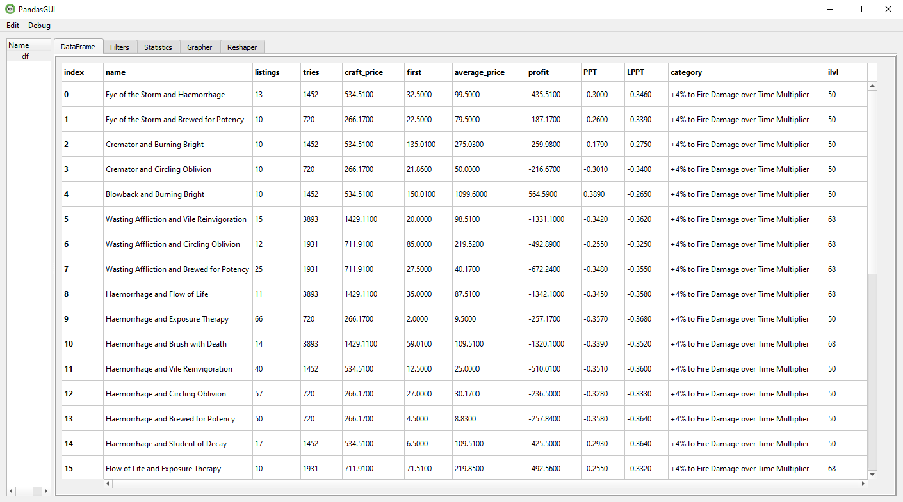

# PoeCluster

PoeCluster is a tool to index all the different combinations of cluster jewels and see if it is profitable to craft them yourself.

# WARNING
Tool only indexes the notables/combinations which have more than 10 active listings at the current moment on pathofexile.com/trade.
Listing all the combinations of notables for medium cluster jewels can take up to 15 minutes because of the sheer amount of combinations. The limiting factor here is the sites' rate-limiter.

# Features

* Fancy scrollable user inteface with all the cluster jewels
* Index all the single notables for medium and small cluster jewels
* Index all the possible combinations of notables for medium cluster jewels
* Double click the selected jewel to open it in pathofexile.com/trade
* Refresh the info about the selected notable
* Prices for crafting the jewel
* Profit calculations
* Sorting 

# Result

Columns are:
* Name: name of the notable / combination of notables
* Listings: Current number of listings on pathofexile.com/trade
* Tries: How many alteration orbs are needed to hit the notable (not guaranteed, just to hit the % of notable)
* Craft: Price of crafting the item. Based on current currency prices. Does not include the price of base cluster jewel (without the rolls).
* First: Average price of the first 2 listings
* AVG price: Average median price of the first 10 listings
* Profit: Profit of crafting the notable. Formula goes: (Profit = AVG price - Craft - Price of the base cluster)
* PPT: ProfitPerTry. Just Profit divided by Tries. It's the theoretical profit you gain on each usage of alteration orb if you factor the average median of first 10 listings
* LPPT: LegitProfitPerTry. Here it calculates the Profit based on First instead of AVG price. It's the theoretical profit you gain on each usage of alteration orb if you factor in the prices of first 2 listings
* Category: Name of the jewel enchant

### Dependencies

PoeCluster uses a number of python libraries to work properly:

* requests - sending POST and GET requests to webpages
* time - to work with time
* itertools - to get all combinations
* statistics - for more calculations and stats
* tkinter - fancy user interface with buttons
* TkTreectrl - addon for tkinter, so I can create table with multiple columns
* webbrowser - open links
* bs4 - parse html and find necessary items
* requests_html - render JS pages
* os - some commands for os
* json - parse json file
* ctypes - to hide console
* codecs - some nasty unicode conversion
* math - just to use ceil()

### Installation

PoeCluster requires python to run. Tested  version 3.8.6.

Install the dependencies and run run.bat or PoeCluster. py.

Installing TkTreectrl:
You will need 2 additional files: https://sourceforge.net/projects/tktreectrl/ and https://sourceforge.net/projects/tkintertreectrl/
TkinterTreectrl file you can just run with with the included setup. py file (it will install all the necessary files in the default python directory), but tktreectrl you have to manually place in Python\Python38\TCL folder (also default python directory).

### Todos

 - Refactor code. It's all in one file and could be a lot more readable.
 - Add auto update for data files. Currently I have to manually download all cluster pages from craftofexile.com every league / every update to cluster jewels. Also automatically download the stats.json file every new league from https://www.pathofexile.com/api/trade/data/stats. Also auto update current league.
 - Change crafting process from mod % to actual mod weights. It will be more accurate, and I could just get all info from poedb.tw instead of craftofexile.com.
 - Replace TktreeCtrl. It was kinda difficult to install and I couldn't figure out how to sort rows by pressing the collumn header (that's why I have buttons and I just have a different list for each button). 
 - Figure out the exact way craftofexile.com calculates augmentation orb count when crafting double prefix cluster jewels with alt+aug+regal. Other currencies I figured out correctly as far as I can tell.
 - Remove all data pages completely. Currently it parses all the downloaded pages for cluster jewels at the start of each run and it isn't efficient. I just need to add all the necessary info about cluster jewels into one/multiple files and read from there. Probably implement together with auto-update, so it just updates this file instead of downloading all the fully-JS-rendered webpages about cluster jewels every new league.
 - Improve speed of execution? Probably impossible, because pathofexile.com/trade rate-limit already is the limiting factor.
 - Add ILVL's of notables/clusters in the calculations. That's a lot of work, but the calculations might be more accurate. Also maybe add the calculations of prices for jewels with different number of passives.
 - Add calculations for just the notable without the category. Some notables share categories, and people sometimes don't care about the base enchant of the cluster.
 - Create an .exe file so all the dependencies would be included? I don't know if that's really possible
